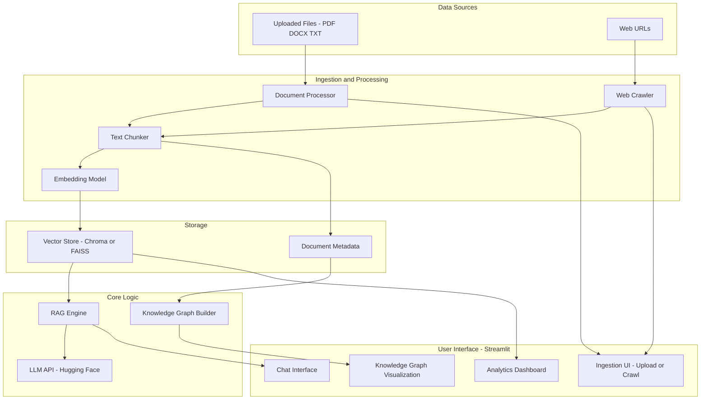

<h1 align="center">🚀 Intelligent RAG & Knowledge Graph Platform</h1>

<p align="center">
  <a href="https://www.python.org/downloads/">🐍 Python</a> •
  <a href="https://streamlit.io">📊 Streamlit</a> •
  <a href="https://huggingface.co/models">🤗 Hugging Face Models</a> •
  <a href="https://www.google.com/search?q=LICENSE">📄 MIT License</a>
</p>

<p align="center">
A comprehensive, production-ready platform for building and interacting with a <b>Retrieval-Augmented Generation (RAG)</b> system.<br>
It supports data ingestion from documents and websites, modular vector storage, an LLM-powered RAG engine, and a live knowledge graph visualization.
</p>

---

## ✨ Features at a Glance

### 🧩 Multi-Source Data Ingestion
- **File Uploads:** Supports `.pdf`, `.docx`, `.txt`, and `.md` files.  
- **Intelligent Web Crawler:** Configurable depth, page limits, and semantic filtering to fetch only relevant data.

### 🧠 Core RAG Engine
- Connects to **Hugging Face Inference APIs** (or any compatible provider).  
- Performs **context retrieval + LLM generation** with citations.  
- Includes **chat mode** with full conversational memory.

### 🗂️ Modular Vector Storage
- Plug-and-play `BaseVectorStore` architecture.  
- **ChromaDB** → Persistent, production-ready.  
- **FAISS** → Lightweight, high-speed file-based.  
- Switch stores with one config variable.

### 🕸️ Knowledge Graph Visualization
- Auto-extracts entities & relationships from ingested content.  
- Interactive, dynamic graph explorer built directly into the UI.

### 💻 Modern Web Interface
- **Built with Streamlit** – fast, minimal, and reactive.  
- Includes pages for Dashboard, Uploads, Web Crawling, Chat, and Graph.

### ⚙️ Robust Background Processing
- Uses `ProcessPoolExecutor` to offload heavy lifting (PDF parsing, crawling) without freezing the UI.

---

## 🏗️ System Architecture

The system is structured for modularity, scalability, and maintainability.


1. **Data Sources:** Users provide data via file uploads or by specifying root URLs for the web crawler.
2. **Ingestion & Processing:** `DocumentProcessor` extracts text from files, and `WebCrawler` fetches content from URLs. The text is cleaned, split into manageable chunks, and converted into vector embeddings using a SentenceTransformer model.
3. **Storage:** These embeddings and their corresponding text/metadata are stored in a chosen vector database (ChromaDB or FAISS).
4. **Core Logic:**

   * When a user asks a question, the `RAGEngine` embeds the query, searches the vector store for the most relevant document chunks (retrieval), and constructs a prompt.
   * This prompt, containing the user's question and the retrieved context, is sent to the LLM (generation).
   * The `KnowledgeGraphBuilder` can be triggered to process all documents, extract entities, and build a relationship map.
5. **User Interface:** The Streamlit app provides a clean interface for all interactions, from data ingestion to chat and graph visualization.

```
```
## 🔧 Setup & Installation

Follow these steps to get the application running locally.

### 1. Prerequisites

* Python 3.9+
* Git

### 2. Clone the Repository

```bash
git clone https://your-repository-url.git
cd intelligent-rag-platform
```

### 3. Set Up a Virtual Environment

It's highly recommended to use a virtual environment.

```bash
# Windows
python -m venv .venv
.\.venv\Scripts\activate

# macOS / Linux
python3 -m venv .venv
source .venv/bin/activate
```

### 4. Install Dependencies

Install all required Python packages.

```bash
pip install -r requirements.txt
```

### 5. Configure Environment Variables

Create a `.env` file in the root directory and add the following:

```ini
# Get your token from https://huggingface.co/settings/tokens
HF_API_TOKEN="hf_YOUR_HUGGINGFACE_API_TOKEN"

# (Optional) Specify the provider and model. Defaults are in config.py
# Example: LLM_PROVIDER="huggingface-inference"
# Example: LLM_MODEL="mistralai/Mixtral-8x7B-Instruct-v0.1"

# Choose 'chroma' (recommended) or 'faiss'
VECTOR_STORE_TYPE="chroma"

# Path to store the persistent Chroma database
CHROMA_DB_PATH="./chroma_db_store"

# Path to store FAISS index and data
FAISS_DB_PATH="./faiss_db_store"

# Embedding model to use. Must match the dimension expected by the store.
# 'all-MiniLM-L6-v2' is a good default (384 dimensions).
EMBEDDING_MODEL_NAME="all-MiniLM-L6-v2"

# Timeout in seconds for web requests
REQUEST_TIMEOUT=10
```

**Note:** You must provide a valid `HF_API_TOKEN` for the RAG engine to function.

---

## 🚀 Running the Application

Once your environment is configured, start the Streamlit app:

```bash
streamlit run app.py
```

Then open your browser and go to `http://localhost:8501`.

---

## 📁 Repository Structure

```
.
├── RAG/
│   ├── app.py                   # Main Streamlit application entry point
│   ├── config.py                # Configuration loader (reads .env)
│   ├── logger.py                # Centralized logging setup
│   │
│   ├── core/
│   │   ├── rag_engine.py        # Core RAG logic (retrieve, prompt, generate)
│   │   └── knowledge_graph.py   # Entity & relationship extraction
│   │
│   ├── ingestion/
│   │   ├── document_processor.py # Handles file upload processing (PDF, DOCX, etc.)
│   │   └── web_crawler.py       # Logic for website crawling
│   │
│   ├── storage/
│   │   ├── vector_store.py      # Base class and implementations (Chroma, FAISS)
│   │   └── __init__.py          # Factory function to get current vector store
│   │
│   ├── ui/
│   │   ├── chat_interface.py    # Streamlit page for the chat UI
│   │   ├── dashboard.py         # Streamlit page for the main dashboard
│   │   ├── document_upload.py   # Streamlit page for file uploads
│   │   ├── knowledge_graph.py   # Streamlit page for graph visualization
│   │   ├── settings.py          # Streamlit page for app settings
│   │   └── web_crawler.py       # Streamlit page for web crawling
│   │
│   ├── chroma_db_store/         # Default directory for persistent ChromaDB data
│   ├── logs/
│   │   └── rag_app.log          # Application log file
│
├── .env                       # Local environment variables (!! DO NOT COMMIT !!)
├── .gitignore                 # Git ignore file
├── requirements.txt           # Python dependencies
└── README.md                  # This file
```

---

## 🤝 Contributing

Contributions are welcome!

1. Fork the repository.
2. Create a new feature branch:

   ```bash
   git checkout -b feature/my-new-feature
   ```
3. Make your changes and commit:

   ```bash
   git commit -m "Add some feature"
   ```
4. Push to the branch:

   ```bash
   git push origin feature/my-new-feature
   ```
5. Open a Pull Request.

---

## 📄 License

This project is licensed under the **MIT License**.
See the `LICENSE` file for details.


